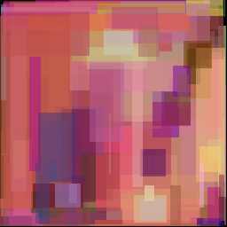
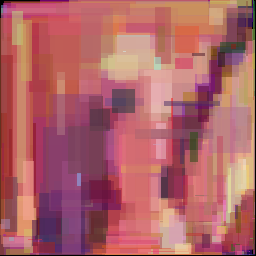

# genetic-drawer

## demo
| Generation: | 100 ~6 [s] | 300  | 1000 | 2000 | 3700 ~5 [min] |
|:-:|:-:|:-:|:-:|:-:|:-:|
|   |   |  |  |  |  |

### generated with
`🅐 = -g`  
`🅓 = 330`  
`🅔 = 2`  

# execution
Run with `-h` or `--help` to see simple tutorial  

`./genetic-drawer.exe 🅐 🅑 🅒 🅓 🅔 🅕 🅖 🅗 🅘`  
where:  
`🅐` - image format: `-rgb` (24BPP) / `-g` (8BPP)  
`🅑` - path to target image  
`🅒` - path to output directory  
`🅓` - specimens count (> 0)  
`🅔` - parents count (> 0)  
`🅕` - save interval (> 0)  
`🅖` - image's width  
`🅗` - image's height  
`🅘` - threads count  

# cli compilation with g++:
`g++ -std=c++11 -Iinclude/ src/*.cpp`